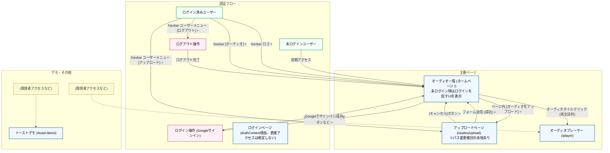

```mermaid
graph TD
    %% ユーザー状態 / 初期アクセスからの遷移
    UserNotLoggedIn["未ログインユーザー"] -- "初期アクセス" --> HomePage
    UserLoggedIn["ログイン済みユーザー"]
    LoginAction["ログイン操作 (Googleサインイン)"]
    LogoutAction["ログアウト操作"]

    HomePage -- "未ログイン時: [ログイン]ボタンなど >" --> LoginAction
    LoginAction -- "Googleでサインイン成功" --> HomePage

    UserLoggedIn -- "Navbar ロゴ >" --> HomePage
    UserLoggedIn -- "Navbar [オーディオ] >" --> HomePage
    UserLoggedIn -- "Navbar ユーザーメニュー [アップロード] >" --> UploadPage
    UserLoggedIn -- "Navbar ユーザーメニュー [ログアウト] >" --> LogoutAction
    LogoutAction -- "ログアウト完了" --> HomePage

    %% ページノード定義
    LoginPage["ログインページ (AuthContext経由、直接アクセスは想定しない)"]
    HomePage["オーディオ一覧 (ホームページ /)<br>未ログイン時はログインを促すUIを表示"]
    UploadPage["アップロードページ (/audios/upload) <br> ※パス変更検討の余地あり"]
    AudioPlayerPage["オーディオプレーヤー (/player)"]
    ToastDemoPage["トーストデモ (/toast-demo)"]

    %% 各ページからの遷移
    HomePage -- "ページ内 [オーディオをアップロード] >" --> UploadPage
    HomePage -- "オーディオタイルクリック (再生目的)" --> AudioPlayerPage

    UploadPage -- "フォーム送信 (成功) >" --> HomePage
    UploadPage -- "[キャンセル]ボタン >" --> HomePage

    %% デモページなどへの直接アクセスや目立たないリンク
    AdminOrDevAccess1["(開発者アクセスなど)"] -.-> AudioPlayerPage
    AdminOrDevAccess2["(開発者アクセスなど)"] -.-> ToastDemoPage

    %% スタイル定義
    classDef page fill:#f0f8ff,stroke:#4682b4,stroke-width:2px,color:#000;
    classDef action fill:#fff0f5,stroke:#db7093,stroke-width:2px,color:#000;
    classDef userstate fill:#f5fffa,stroke:#3cb371,stroke-width:2px,color:#000;
    classDef access fill:#fafad2,stroke:#b8860b,stroke-width:1px,linestyle:dashed;

    class HomePage,UploadPage,AudioPlayerPage,ToastDemoPage,LoginPage page;
    class LoginAction,LogoutAction action;
    class UserNotLoggedIn,UserLoggedIn userstate;
    class AdminOrDevAccess1,AdminOrDevAccess2 access;

    %% サブグラフ定義
    subgraph "主要ページ"
        HomePage
        UploadPage
        AudioPlayerPage
    end

    subgraph "認証フロー"
        UserNotLoggedIn
        LoginPage
        UserLoggedIn
        LoginAction
        LogoutAction
    end

    subgraph "デモ・その他"
        ToastDemoPage
        AdminOrDevAccess1
        AdminOrDevAccess2
    end
``` 